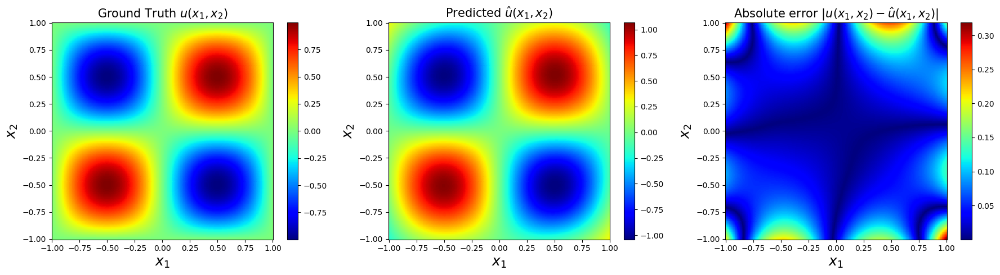
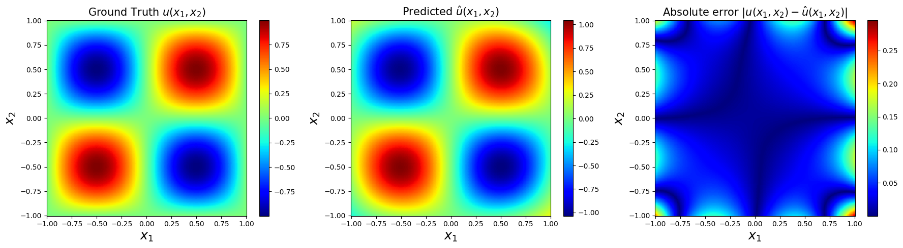
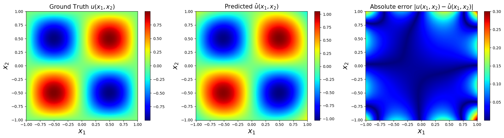
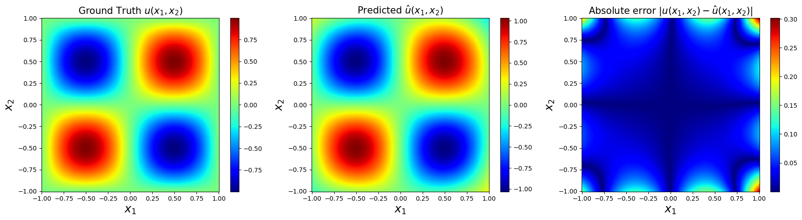
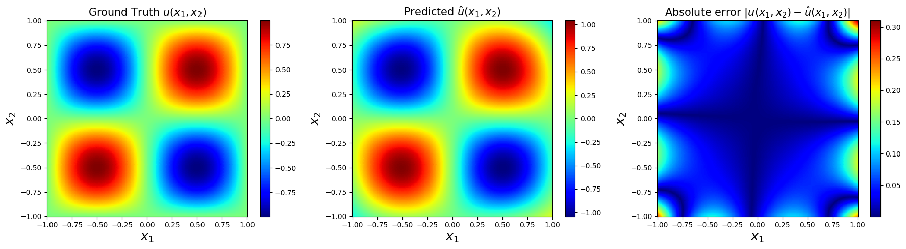
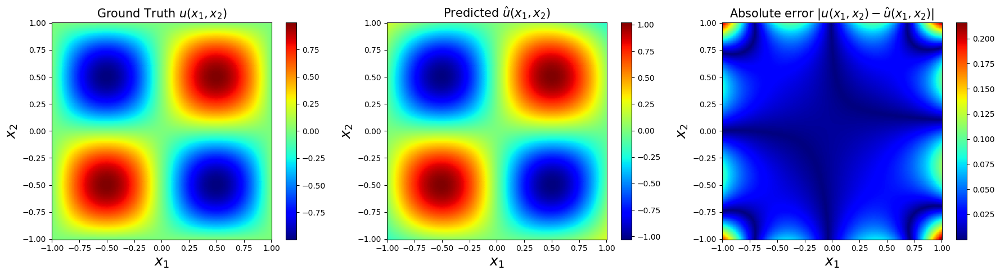
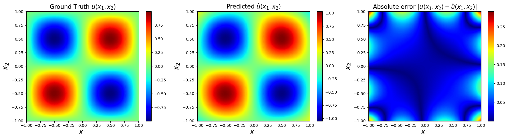
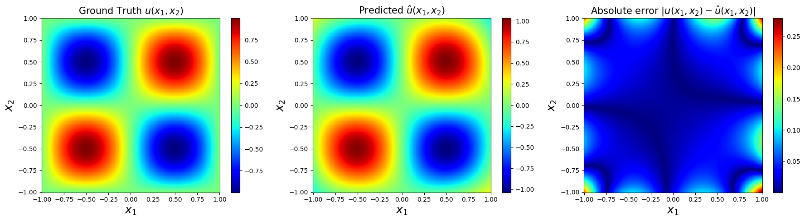

# 利用神经网络求解2D-Helmholtz方程

- [利用神经网络求解2D-Helmholtz方程](#利用神经网络求解2d-helmholtz方程)
  - [问题描述](#问题描述)
  - [环境配置](#环境配置)
  - [优化目标](#优化目标)
  - [数据设计](#数据设计)
  - [研究目标](#研究目标)
    - [改变边界控制点数](#改变边界控制点数)
    - [改变PDE控制点数](#改变pde控制点数)

## 问题描述

As an example, let us consider the Helmholtz equation in two space dimensions:

$$
\Delta{u(x,y)}+k^2u(x,y)=q(x,y),(x,y)\in\Omega:=(-1,1)\\\\
u(x,y)=h(x,y),(x,y)\in{\partial\Omega}
$$

Assuming that the source term is in the form like:

$$
q(x,y)=-(a_1\pi)^2sin(a_1\pi x)sin(a_2\pi y)-(a_2\pi)^2sin(a_1\pi x)sin(a_2\pi y)+k^2sin(a_1\pi x)sin(a_2\pi y)
$$

We can easily fabricate an exact solution to this problem:
$$
u(x,y)=sin(a_1\pi x)sin(a_2\pi y)
$$

## 环境配置
    python ==3.9
    pytorch == 2.0.0+cu117
    gpu == NVIDIA GeForce RTX 3050 Ti Laptop GPU(RAM=4GB)

## 优化目标
For a typical initial and boundary value problem,  loss
functions would take the form
$$
L=\lambda_1L_{pde}+\lambda_2L_{bc}+\lambda_3L_{init}\\\\
L_{pde} =\frac{1}{N_{pde}}\sum_{i=1}^{N_{pde}}[u(x_{pde}^i)]^2\\\\
L_{bc} =\frac{1}{N_{bc}}\sum_{i=1}^{N_{bc}}[u(x_{bc}^i)-g_{bc}^i]\\\\
L_{i} =\frac{1}{N_{i}}\sum_{i=1}^{N_{i}}[u(x_{bc}^i,t=0)-h_{init}^i]\\\\
$$

For the problem in frequency domain, $L_{init}$ is ignored , and the loss function can be simplified as:
$$
L=\lambda_1L_{pde}+\lambda_2L_{bc}\\\\
L_{pde} =\frac{1}{N_{pde}}\sum_{i=1}^{N_{pde}}[u(x_{pde}^i,y_{pde}^i)]^2\\\\
L_{bc} =\frac{1}{N_{bc}}\sum_{i=1}^{N_{bc}}[u(x_{bc}^i,y_{bc}^i)-g_{bc}^i]\\\\
$$

## 数据设计
According to the problem described before , we need to generate the data for PINN. We assume the area is $x\in(-1,1) , y\in(-1,1)$ . It is obviously that the more data points we use, the better the training effect. But huge amount of data will significantly increase the computational cost, thus an appropriate amount of data is necessary.

First , we seperate the area to the shape of 256*256 as test data.

``````python
x_1 = np.linspace(-1,1,256)  # 256 points between -1 and 1 [256x1]
x_2 = np.linspace(1,-1,256)  # 256 points between 1 and -1 [256x1]
``````
Second , we conduct Latin sampling in the interval as PDE point , 'N_f' is the number of sampled data .
``````python
X_f = lb + (ub-lb)*lhs(2,N_f) 
``````
Thirdly , we sample boundary point randomly with the number 'N_u'
``````python
idx = np.random.choice(all_X_u_train.shape[0], N_u, replace=False) 
X_u_train = all_X_u_train[idx[0:N_u], :] #choose indices from  set 'idx' (x,t)
u_train = all_u_train[idx[0:N_u],:]      #choose corresponding u
``````

## 研究目标
+ Solve the 2D Helmholtz equation with source correctly ?
+ Time used ?
+ The influence of bc point number and pde point number ?

### 改变边界控制点数
    N_u = 100
    N_f = 10000
    Training time: 21.98
    Test Error: 0.13519


    N_u = 200
    N_f = 10000
    Training time: 21.98
    Test Error: 0.10051


    N_u = 300
    N_f = 10000
    Training time: 22.74
    Test Error: 0.10007


    N_u = 400 
    N_f = 10000
    Training time: 22.23
    Test Error: 0.08802



### 改变PDE控制点数
    N_u = 400 
    N_f = 20000
    Training time: 39.04
    Test Error: 0.10225


    N_u = 400 
    N_f = 30000
    Training time: 50.46
    Test Error: 0.07301


    N_u = 400 
    N_f = 40000
    Training time: 66.36
    Test Error: 0.10518


    N_u = 400 
    N_f = 50000
    Training time: 81.16
    Test Error: 0.08737



<script type="text/javascript" src="http://cdn.mathjax.org/mathjax/latest/MathJax.js?config=TeX-AMS-MML_HTMLorMML"></script>
<script type="text/x-mathjax-config">
  MathJax.Hub.Config({ tex2jax: {inlineMath: [['$', '$']]}, messageStyle: "none" });
</script>
